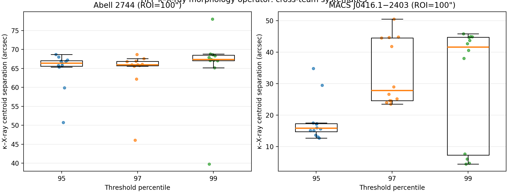

# **A Response Sector in the Stress-Energy Tensor: An Alternative Framework for Galactic Dynamics Without Cold Dark Matter**

**Robert** D Kitcey Las Cruces, New Mexico, USA *Email: rkitcey@lernaean.net* *Preprint for Zenodo* *Date: February 24, 2026*

### **Abstract**

We propose a modification to the stress-energy tensor in Einstein's field equations, splitting it into a baryonic component and a response sector activated by baryonic density gradients. This framework aims to reproduce observed galactic phenomena, such as flat rotation curves and the Baryonic Tully-Fisher Relation (BTFR), without invoking cold dark matter particles. The response sector is designed to produce a 1/R acceleration tail at large radii, ensuring compatibility with galaxy halo observations, while remaining suppressed on cosmological scales to preserve ΛCDM successes. Using ≤2 degrees of freedom per galaxy, we demonstrate that this model achieves significant improvements in fits to 175 galaxies from the SPARC dataset, with 92% showing strong enhancement and 97% passing Bayesian Information Criterion (BIC) tests. The BTFR emerges naturally from the dynamics. This approach offers a parsimonious alternative to dark matter, grounded in general relativity, and invites further relativistic formalization and testing.

**Keywords:** modified gravity, galactic dynamics, rotation curves, stress-energy tensor, MOND alternatives

**1. Introduction**

Einstein's field equations form the cornerstone of general relativity (GR), relating spacetime curvature to matter and energy content [1]. In standard notation, they are expressed as:

where is the Einstein tensor, encapsulating geometry, and is the stress-energy tensor, representing sources [2]. While remarkably successful on solar system and cosmological scales, GR combined with the ΛCDM model—incorporating cold dark matter (CDM) and a cosmological constant—faces challenges in explaining galactic rotation curves, which remain flat at large radii rather than declining as predicted by baryonic matter alone [3,4,10].

The flat rotation curves, first systematically observed by Rubin and collaborators [5], imply an additional gravitational influence, traditionally attributed to CDM halos. However, alternatives like Modified Newtonian Dynamics (MOND) [6] modify dynamics at low accelerations, achieving phenomenological success but requiring relativistic extensions such as TeVeS [7] to align with GR.

Here, we propose a novel split of into baryonic () and response () sectors, where the latter emerges as a reaction to baryonic distributions near density boundaries. This avoids new particles or action modifications, preserving GR's left-hand side while enriching the source term. We outline the framework, derive key requirements, and present preliminary fits to the SPARC dataset [8], showing superior performance via BIC [9].

**2. Theoretical Framework**

**2.1 Modified Field Equations**

We modify the source term as:

where describes ordinary baryonic matter (protons, neutrons, electrons, etc.), and is an emergent response activated by baryons, not a fundamental field. This response mimics dark matter effects on galactic scales but is negligible cosmologically, ensuring compatibility with ΛCDM [10,15].

In the weak-field, non-relativistic limit, the response yields an additional acceleration , contributing to the total gravitational field.

**2.2 Activation Mechanism: Baryonic Boundary Layers**

The response sector activates near regions of significant baryonic density gradients, parameterized by a dimensionless quantity such as:

or compared to a critical acceleration ![img](data:image/png;base64,iVBORw0KGgoAAAANSUhEUgAAAJsAAAAWCAMAAADgkR64AAAAAXNSR0IArs4c6QAAALdQTFRFAAAAAAAAAAA6AABmADo6ADpmADqQAGa2OgAAOgA6OgBmOjoAOjqQOmaQOma2OpCQOpC2OpDbZgAAZgA6ZgBmZjoAZjo6ZmYAZmaQZma2ZpC2ZpDbZraQZrbbZrb/kDoAkDo6kDpmkGY6kLbbkLb/kNv/tmYAtmY6tmZmtpA6tpBmtpCQtpC2traQttu2ttv/tv//25A625Bm27Zm27a22/+22////7Zm/7aQ/9uQ/9u2//+2///bcGY9tQAAAAF0Uk5TAEDm2GYAAAAJcEhZcwAADsQAAA7EAZUrDhsAAAAZdEVYdFNvZnR3YXJlAE1pY3Jvc29mdCBPZmZpY2V/7TVxAAACW0lEQVRIS+1Vi3LTMBCUXJyq0Bpiah4NqXklhRYotkFCsf7/u1i9bCmOjWdoZ5ihN5NJYq3v1nt3a0Ie4p9WoHn8nRDJaDaLZcPoGZ+F/HuQ+vQV3NTbTZtfzsgmT/luFnBGrhkQCW76s12Ogdvnm+BIvYPOh0Ow9BYnuw/+WL33D6yuGU1WI/d5GJqSrE0TEQmKGm6nnFTHYyWrRdjFelRf+ZpXRyDeIVDLgVX5DBXcP2HHB3Bb0cMkW5NKU+rC61aN6abKkE39cbQXNdJW6e3ulatZX/yM+t/mtoQqtQySubQdbAsN2jyUSHPDsMUMwvpCa+EDmgidc1fQ5I0n4Q6/aE41S3t4PMQdm7bIemq4x8JUqalrgj62aO2SiG5PBT36VtAFr1ninssM4q8nlKKoGQVclyzjXoaeeLM/bzG3bSdJW5w5Dc3NFmbzhdwGHRLJBZcs3SiHMpvQ5isiz3tB9NlA6cG8uaKuRIWh9iFZ2Lr53NBCI69bAfOFMQj3wSTTwxDF1d68eUEsqMr6DG3+9JBumu+0bjE3pw7my/iDDXkCGiZLaNo/puZNgJp0/t4WS9wIt3DhWm+bMWplAOvRD3TrNkFd9TuBqVY3L4/l6g+mbYtKBiq6oc4KbP1uMzp5BV2TJvKQ/YHruRku1pIFHqkO9vUzVGxoxidNW77A4jzCoLKlKrWdYulMMudvbs09TO84TUN726eGJi04lvdSUPyw3cNDYk21ZQ/Qk6Y9xN/plfidMOSGfRg17TslMkw27sgWO2na98wteiccqtWb9j0zeUj//yrwG/eBTO21FhHdAAAAAElFTkSuQmCC)[6]. This "boundary layer" concept, inspired by fluid dynamics, confines to galactic halos, suppressing it in homogeneous cosmological regimes where gradients vanish [11,15].

**2.3 Tensor Structure of the Response Sector**

For a fluid-like response:

![img](data:image/png;base64,iVBORw0KGgoAAAANSUhEUgAAATQAAAAZCAYAAAC/xNLDAAAAAXNSR0IArs4c6QAAAAlwSFlzAAAOxAAADsQBlSsOGwAAABl0RVh0U29mdHdhcmUATWljcm9zb2Z0IE9mZmljZX/tNXEAAAzDSURBVHhe7V29c1pXFj+Xca/US7k8MpFpnRmBayugwjShoCGNkNMsZMZq1iwSRB07a0izhi0SGjIhhbUzC9jbxuCZJaVCJvBSamvzB4i7v3PfAz1kvr8kvO81lp7uu++cc8/93fP5fC+VSpF92RKwJWBL4EOQwL0PgQmbB1sCtgRsCbAEbECz9cCWgC2BD0YCNqB9MEtpM2JLwJbAXICWfHApRaBA0WyWqBynAmWpU48R1Y4ogvsNyNMbrdK+symSybDMHUUoXuC7uHC/s3tGWryhnr+Ix43x2Q7td0vCXgpbArYEbAksK4G5AC3ddIpqlOQZHVC97ibytYn0HMCMKNGR5HfplPNp1ApKyffLFx6qyjr58bMvQ+SKFSlb1qiM5/dTXVEP70iflqEHMi+b6fRGQC2Jdx5FyrRbrFO3tJl3LrtI2/R8eOe1jLRClDiOUdOW7zYt3QdB671k8oE8EgFYW+MuL2U7w5vf43ZROl0Szn2AVOdSNvB0QLuewdvWKd3simKIZEQIOvNGKVGEJUe6egk/T0384HKTB/CG4Ru5eLP5IiEq1utU2hCAroIxBRJU3ApLttTdF/Vjgpx9FCrW5TYeGtsk71Xo17JzhD963YvIomjEXY5UKi2XnW+Z5++R3qYLMkArZlpYcU+VUuw2KguqRX38GfkibZe8DFj1PLGVFX6wIzuai/wAOl/7GJaYU7CCaJkaybxmTNFHMPVuDwVNfFuGkWnPGrx4KCFjWwVm0/i6i39Pl2B9JzxSaEew0Ddnfd9FWdg0bVYC96jTIsoWDfcL1loLga1owg8LCiYUW1BeIoYhNqhUDO0EPxR8DIDq9GXlLYYupAZLDJd8zTGxZlr4H5BsxDWOk8kTAGa0ijlNC62A+zz25ITvFxUQrpNtFc+DKwyi1/6udfKxVXP7jynr1egsh0Ntqwi3id1mCdzjuNg+lQweaudwHmGtYe93gWDpdFO5lXDP1J95bL8QF2A24JvdjFTKVNuuMZd1rLrRxHh/WJmj0aokJ0DPuG++e4wU+2CEXMLky2skKEa6knqFyg0vXCAXgHv0NGxZRs6QqFDvMYDW2dyuZIU1EcMyzms1OkKAk/Mym06+cEgiHPLKeLkCFz8peV2s9FnpMZJNxNbc1ANnFXOscsPeJZkzX8nwp72jiF8YuTjW4wTReZuO8zGCI+RIp2/XJYS8erUnX4iDfJ3G+abRSo8KAeFILUDrUFJAb19ABiE6AOeTYWZBlahlSAFTYHZXhDcG/Fbq4+X4N3cHwPveGFihDbi2iTGurbGhXlO2ytYlNiJ+1wKRgRW6ILcbf6yWy5D7uE5VQtyynaNc203HdUnHOR+yyxm425t1/1xuD1GjRR1TEkP0WaTT17u+JzBJcKuYY5ULc5dkngx/1PO5/YKeo6Kg7geA4UBzBOjieZs0Qbce32K5699kqP34O+o9zpDjPEiy4HdIWbt64jgTn/z2hmKaUKCb+nmxVRoAmmEJwTkMFdcWY7JabXAzF6N4gacmbRgjKQK+4Y52TYvMxXFBRPdu4xplkbKXz44/u+8DmkZYpM2uUyRduswp0t3URRy0lG4iVODBcxcbS74MaFRyvE76WOnzmIHTefVuFXNY13UZefM8d0nmrzIxauxlqR1jMCMHkbgCiYKTcNMcnFl1nS2s3EO3iOOg7F99/cTvvRPjF3YJqP0mpoDUahWW3jkd7JXpH130vLtPRZ3Hsme4F6LfXMtHnq4tNOWWIQM5zoyZleMVj1uJyzmJJuVmR6kacymvWF3KoiMKrZiXWaYbZZGOzrqNsUgH7rUf7jVHPnEqsuUNC3VicmcW4lYxRtGHJJIZpoWwieO2c+ndKuYweVla3krA/ZDG7ck8mYSr6SARrfyJ3KY1BosNxxhk/ZmgAuPPCmwIyMtBj04p9ehaGUZnObv0/dejX2iA4r/F59+6yChjRYWEp0Jux/JW5DWgqU1sVbRVaO/yc6zE5ZxAhtrs0cRQ7KZ2DgHjhFmb6728WMbPwOuIsAHChSps0LeAbvK4ThImza1Xyoq+vnup586MA2UAcNMpW8Uc098yx4i7IHOzWiHEVo4JXn2LzXJrDqbWOFSv0o+N+/QMOoqC1V7uF0GHz/xUyC8PugrQWOlrR1AxlF98iNfNWE6fx8Fm97QpnExKF7KwtVyEAsi+ZjvbWd6hwBgAwXErY13RrQGLqIqYShPu50avEbHLDptjpu0b3tmRFViO5N0FwOnUvtyRBwheT6sRXMUcq5TD3ZF5g1q6JKn93qvt7NDLS3DpccNiQ4A9lbrV+jCrvPXqD9Q4TFDAIRA/61z92tgTuwC36tGTHr34O/lB76LJCwVoDGboXMKFAtmjIGrQrl9vxJjOKYgMlB9Kl/NFCGkrinWOyMcPma1L/Zo1BJ6nZqpWqUwzzXUjlnP9DLs7yAR5WsQFwEZiCJu/Ax5QkrJtrV59gI4CI87ADxKHYCcLflC1z1nGJVvXuDZR1RTO2L42KnbpD0bJW4gjtlI2ah8JHSVog9N8LYBuXoHZOJ3rF+nONAd43YR+rlvmbbQLfgx5Hw61C7YJJVFDQf506Z3jL4fenh8oUWAdLh7TbvkrGOafUcH0Nw239KUIXmEvi1F72ZhXdr65euj+RTxT41abGeXExUN3Q+w978f1NPrE+5bi7ocUrbyhAsBMUu3qv6eX4vHVC7z/d8o9/ILo258opn9JDw/yJP9m0qnnQGcLdPI4AwQVoDWdKZRd9Lf5jVOcY0zRIDmhaH4Up5ZxurI7o9Mx1auIOJ4ZaXnu52xg3LprymYCsJuDXAcU8sapXNGHa6JU/AztWfk8OZ1cvmJcADP179a1eg1iOVZ+uivjh2Uya/vauGC/KhOCsrGsufSHJd3/fZAoGqNz/cz7LHPo2ob0c80y19Au+LzsRmolgAM3psDG5/6rqPbyvYBIqtKG5KeXPd/LoDgpnAwsMb+e6R00DkXFGj979ZL+cRikAltGndwV9rKw7mXHWZXavViPXv0CCyoIC2r5mNbNrcjA++gUYNP9nosXUBqG5EU/Jvfz16Symw8uqYD35xWdlasf6XPxLfxmXTylNxVJis4Y6Oz8atLJFqhRjjK1l5NPWe/usSpMU7ELT2LgEiTDuxJ1t7iA9ucwGfO34NbMgHAch0smojIeGC5dGBU/GzXdbbd6cZ3foFZwEr83Yjnjhi7KT9NMMvC8U9vXVIkOu7qWZMsMa6W0aYLOzTgFlUpY8wX1c2Z5MzFrlrm1XVB5EKpd8AcjY40okQqw+5AG8AQHojHKN07EXrY9BEos1z3s5QZHrqo+eou9jIJ4BYLJ8P3eHknY9cZermAv+xHTmqUYofRu38H6yQC1istY/6fEiVQ9B8y5nzATBiXQudvzCtQlMZ3/lFR58dkQnRMBrX/KcgYqqXFTN9IGCY3CpMmSpei0g/qnVjBP3TVX/C8jLD7VO1m4S74canSMeJlRpmJWEc86+R1u9VKxHLjQmdoBWaIGkzmbgx9rKGJS+5oRfkBdH1zKeS32WXVu1uVSmLNG/VynzN1oF7waaheErlraBZk3zjomi9leKxIQADyUTZyQ6sBBKKhg6a00gO9UeBJ/pHonh+JbuLHY18fBTs8VcDko/I0SaQd1YryX4yj7WKSwdZ51GTXWyICeivvIGPyk53pf/vgWCQOmU++5/EkHf/RCHXpM5+MXFGdAthTgTrHQjJQ6qnbpAp//KYa8xAWnOHaNDcOnRSNA5wlL5f+yHK3xeT55OwmSGZ/P+NrGfkrg00Vj37htrV6D0MGY7oul+eF2OPMa176mPgCQwdc2GMwW+trGFJ2bRz82oJ/rljlbTHwV4vi6DQBLaEYXi9UdZDfOebP4HHo9/HV9nVpvJfayY7CX3YEv1F7m8LlkWb310/kzVOn7bwfMjKXt0K8Kc5jOCn33+R59fAA6/4X4Wp/OxgGd//kKdL7fTTAZ0FQsw2hU525OAIIhJLNgS7VG8Y1BAdc82nY7Y0v4Cohzf1/Fb6Zdt9HqNY2mZf6+ND+Wl49rX1PumvM6bjc3vVN0bp757oJ+Li1zf7gHnkW0arYDcawIB9bc/xWIip8h6A2kwPcKJe9lDmXx3uW5OJbl5Bv9ONY8gl7lWF7/wwro9IPOtPye6TzFC0y6sGsdf+AbY+icCGhGQWZwleT+f821QKvXnRfQmnmyde6GBrzK0FcNlGIEnpA1ETCvnmyLXJelcyKgqaZz54Zrl+ZdqTs8/rZavdYpknXzZOvc8Oql/+N0nJrmWBOV94vG3Tlwf8p7eW7Tbp3a9P7cWH+TzsVwZ2qWc7Ps2G+zJWBLwJbA4hKwAW1x2dlP2hKwJXDHJPA/DB4gEDCe0u8AAAAASUVORK5CYII=)

where is energy density,  pressure,  four-velocity, and  anisotropic stress. Asymptotically, this sources a logarithmic potential , yielding — a standard feature of the deep-MOND limit [6,16,17].

**3. Requirements for the Response Sector**

**3.1 Galaxy Halo Phenomenology**

Observations show flat rotation curves: ![img](data:image/png;base64,iVBORw0KGgoAAAANSUhEUgAAAIYAAAAWCAMAAAAywRTgAAAAAXNSR0IArs4c6QAAAJxQTFRFAAAAAAAAAAA6AABmADpmADqQAGa2OgAAOgA6OgBmOjo6OjqQOmaQOma2OpC2OpDbZgAAZjoAZjo6ZmYAZmaQZma2ZpC2ZpDbZra2ZrbbZrb/kDoAkDpmkGY6kLbbkLb/kNv/tmYAtmY6tpCQtpC2ttvbttv/tv//25A625Bm27Zm27aQ27a22////7Zm/7aQ/9uQ/9u2//+2///bKN3bFwAAAAF0Uk5TAEDm2GYAAAAJcEhZcwAADsQAAA7EAZUrDhsAAAAZdEVYdFNvZnR3YXJlAE1pY3Jvc29mdCBPZmZpY2V/7TVxAAAB0UlEQVRIS+1V23KCMBAFik1brdXeld7U1gYsNJj//7fubhITbpk6OOOLeWCGsDl79uzZEASn1a5AxsJRfnRxxDAvJ/Oj0wAC8uWbaIjbD0uHj9a9uO0Pliox+BB7w0NY0QxIXTmk6ox2UV1UPWAFi7HC8q16Nn1XWlySJjI5By4RUCjOlEhty0a1f/eAiYecI7Iu3pyH1wLkkMkN7WzRKII5O22JbFQHy26wFCrk8bq8R+0zNsjlaziHjNAEzHyhelCQEPgI+EBNkEywUbj0RiXK5VFOw+gZ8D1gwSeCpixGqX9nkGO1XtgRMS3A3Bt2TYy6u+JEAV0TJ9g4305ACC9Y5nqDgwXMiGBOXTpVHiv3mJqaurtRDo0FlEDt8oFVvbFA0k82gz6JxWTUEkuj2RQ3ykIow6DTPWDB0vUGHhHkEr30SXQF6epVw42yEKQeKmJotIL9ON5A7TK6J8zS7UQUmkavN9wohwaby9Udnv03mEyix8qfRBkBriW8NsIx3WS7wai5oxLlfFuG8VeCrt8HrIpt7g2729ypsam9FjheSoceYI3x9N2iLYRkAjQEU7bqAVbrQfe4dogipvAzMrPXA2xzyD/sQcH8bjh9PaQCfxtWPV7rfO5ZAAAAAElFTkSuQmCC) constant at large [4,5]. Baryons alone predict ; the response must provide ![img](data:image/png;base64,iVBORw0KGgoAAAANSUhEUgAAAG4AAAAWCAMAAAAW9FllAAAAAXNSR0IArs4c6QAAALRQTFRFAAAAAAAAAAA6AABmADo6ADpmADqQAGa2OgAAOgA6OgBmOjoAOjo6OjpmOjqQOmaQOma2OpC2OpDbZgAAZgA6ZjoAZjo6ZjqQZmYAZmaQZpCQZpC2ZpDbZra2ZrbbZrb/kDoAkGY6kJBmkJC2kLbbkNv/tmYAtmY6tmZmtpA6tpCQttvbttv/tv//25A625Bm27Zm27aQ29uQ2/+22////7Zm/7aQ/7a2/9uQ/9u2//+2///bMtxLDAAAAAF0Uk5TAEDm2GYAAAAJcEhZcwAADsQAAA7EAZUrDhsAAAAZdEVYdFNvZnR3YXJlAE1pY3Jvc29mdCBPZmZpY2V/7TVxAAAB4ElEQVRIS+1Vf1eCQBDkKBWtFDWs1Ip+CJWKWFAn9/2/V7u3x3GJ8Hj+m/ueyMObnZ25ObSsU/0DB/hkYaiMBqtmmrNrE9YMA6uifoJXBmU/wB2/rGkjnh7zxlEbcAWsIR/vrXGl8DsAtpEpPZNPDlXssJxO+HhnwBrxCX8k12VjQHOHWtCjcm1mX7hMFg1lwKydx+z7O7SquniXrEtRmLyASLRJVsQGePut7ZXtZQVyJgPGnWGSjasm/TMkUWwd1xgcm81FiNRhmU4FxYAFsLKYpkKgUiJ8SErrlRbliq038Au6pDQFlu5HOANGtlIQqkvRoQsxWVnQiRfsGDLtbUFHQQF2DZMzosImdLgH2nitrozM1an0GjCImfi4hXibVeyCeqpwOJYMNVbNScjpKChSTQ4LWWuJmuGwuHDp7LxOAEf5mU29dsI95qJwUgKnFY8dG0ovimTuyeMT2OHzubbbgMn9xTl5b4VOp7N3N5GWB6Ps5rOf0LYeOGTV506zlwfygY47oDnF1xN8k3Ckg48ILxi9PMrO1Xip+FRQTO3gFrNBt8Wv1tZ2Zf0sgzbKFAnSwXh5aPcnrQlK3r92IHB4ZG26i9hpJ/CaiBmkkDv2dKySsT3uH6E+8adfj3fgF53oPF7GqsfhAAAAAElFTkSuQmCC), matching MOND's interpolation and the empirical Radial Acceleration Relation (RAR) [6,18].

**3.2 Cosmological Compatibility**

The model must align with CMB, BAO, and large-scale structure data from ΛCDM [10]. Suppression via boundary dependence ensures in isotropic FLRW cosmologies, consistent with relativistic MOND approaches [7,15].

**4. Phenomenological Predictions**

**4.1 Baryonic Tully-Fisher Relation**

The BTFR, , holds empirically over four orders of magnitude with low scatter [13]. In our framework, it emerges from , without fine-tuning — a direct prediction of MOND-like dynamics via the geometric mean of baryonic and critical accelerations [6,14,19].

**4.2 Degrees of Freedom and Model Fitting**

With ≤2 degrees of freedom (DOF) per galaxy (e.g., normalization , scale ), we fit rotation curves:

1. Compute baryonic from surface brightness.
2. Parameterize response ![img](data:image/png;base64,iVBORw0KGgoAAAANSUhEUgAAAFoAAAAYCAMAAABN5hpXAAAAAXNSR0IArs4c6QAAAKtQTFRFAAAAAAAAAAA6AABmADpmADqQAGa2OgAAOgA6OgBmOjo6OjpmOjqQOmaQOma2OpC2OpDbZgAAZgA6ZjoAZjo6ZjqQZmZmZmaQZma2ZpBmZpCQZpC2ZpDbZrbbZrb/kDoAkDo6kDpmkGY6kLbbkNv/tmYAtmY6tmZmtpA6tpCQttv/tv//25A625Bm27Zm27aQ29uQ2/+22////7Zm/7aQ/9uQ/9u2//+2///b4awlMQAAAAF0Uk5TAEDm2GYAAAAJcEhZcwAADsQAAA7EAZUrDhsAAAAZdEVYdFNvZnR3YXJlAE1pY3Jvc29mdCBPZmZpY2V/7TVxAAAByUlEQVRIS+1UbXOCMAxuUeycGwPdq1PZi7gNK250lf7/X7akDRzqoXzxbrdbPhQOkidPkidl7N9+Vwf09bwVoZXg3ozJy7SVNzrJixxPDuZND0TJTspkZ8n0eTsmjOn+EvFM3AN8rzmqiGaMKYB2RwszcWi9bKQWcDSYBUwgP7CwIZnwc/PCmyP0mSOqkLA9yDZP0NnaB0A1i67lK31o4fcUHh9pcoQMua9FAMQwDqsIcj0YuZIsVcgzce/UEQklmOfm5lgGGAlT7L7CG0Hjo4jcTzSsbhO5MVOlCeRVlK0qtvZC0EUUsqzWjr3WW6bk7KDRRd9VuffByRubivB1kmUB9psdIFVUQWdWt01GfcMgqz9iBloxi1v/6570YGJwyLjL7WJM7D0CsuLjkZ9nggcM9MJ7ko+F83MMYGFQ1vwqL4t+5925BnkRdDF8gF2kjaJKiW0SFjef/RTmrAdLHaA03a6Uuq6qwuHUrRhi7vqa7ISg/BTucshWYoApmIvZ3S0F+tuyN+uFQittZxsRGviydapC8DPxpNzwsgMH5rFdW7lkFKA4Cgs6GiJ3b4Yyru6idcubz2Edu/mwIScyxVveXifK/wdhfwCUljRE/PyhlgAAAABJRU5ErkJggg==).
3. Minimize ![img](data:image/png;base64,iVBORw0KGgoAAAANSUhEUgAAAOwAAAAaCAYAAAC0GLAQAAAAAXNSR0IArs4c6QAAAAlwSFlzAAAOxAAADsQBlSsOGwAAABl0RVh0U29mdHdhcmUATWljcm9zb2Z0IE9mZmljZX/tNXEAAAoASURBVHhe7Vw9c+pKEm29cu7NSREB5ZStWvgBLuTEEQEJGWRrJWQUXlhnJLDRg0wJAZETQ/kHQEJKERhS/wB+wLuzp2cQSEiAxJfhPilw3RKjmdHp6Z4+Z1r3rlarUXRFCEQI3AYCd7cxzWiWEQIRAozATThsNfUtNKMT2GLFvqDYuK4FfiBqGCFwIwiEctg8HKcAxxnh5dLFJlntF+rWz+8Y9XFM6xdJsM+mmzN6XHQ9zlit5sWgpFMIv74RE0XTvDYELuUH+X9+/ypkO5rT3wI7bDV/LzKFe7KEoPh8QCXdoMbzC8UuhGa2PaPmRCfTLFBuNhSLrjtQ1Otdrdrui2LHuNCMomH+jghcyg884yTY3/4dPCWudxfa4yPxjkq8myXTRUpkicbjy5hNOqTVFD3dJLPQotmwKjZ393p9rD1jJ34PMCUJCPri6MXXtaXRPL9SoUdJa0ibwSnA662a5O8/RWGao0r5hcYbQS5MP9fU9hLYpL5fZUYnr3QT601lk2H9oFpNiZL2RslZODtujPMr+a+ilshqwR3WabB5q0HTSpsWF0iHnePyS1jNtNBNk/RSgmo+2/s4VtPAXwOurzQ1bSADPxOw6yOasZNlCjmyhkMX5eD7ummHGHuANIKNBc7upQncort41IZlQn8ZylnezOSIaf7Io5fChtcRH6BIzHv+rxrED+atN+qkczSLwxYHIjb/n/I3U6M/AqfE9lj5+2/xkWj/mKjDC7BfHCH6GfTdF+J3E5fUzv9AFeHVB+IvFjV7oAUPfQSrseTxckEZBQ48Hppg24wD3bDyIDS9RH3RFuMLB9oD16nnsWvCJogfcCbayrxSseIOvGHwyP/j+9eH3taw3P+o1eoilMPyJBtLZ2XltkQ/47jZdp+Yq3aM216Am4ZTBtYJ3kf+TjWjKTbYYmXNReJPOUoj45jOaLeekC1TM63TW6tMYDY3d10TNoH9YNAgc1Sk/oHUkZ21sXRWKKp/lURbWzmsnW7ZKqwNkEkYcNim7LxFGf0VnE8m9uIVf4r99lbDr57fzOA2n3Dwg6CriLlqe9YUE3BQo/TsmxoH7Wtbu5USuJxfnObUKhXI7IzOx3fnH9QbpZG6xsFbfWY2eAf6SOPh0wtbO5hNYRM847zn8yhrAPlcWpi9D6TaXv5/9XhdCTZqlw/mB4N3WMsn+MoTDdDKtx5OXFz+saZocpwExhHS335pcPpi/0/FYfnH1syiWb9B+psy6LyVUdFBtGW05/XxiKTeFZ138D5eIHiAanvD+UIKWWGvNZ89fWpcTUHwoTxZzQnZ/GXQ+qBEeUh90ug97GSDtpfOh3QYfMdPy5t/TSCA5OhpyYfymGfGeMURWz+QMBVPPBCNpoTN+KTXRfC6EmykGBTAD5TYhEAK8uoMvuq+ThPYzLLaFCdshAWCzykKBIFR2kaO859Nf/uvclj+kSlxPJ8Uab6B3bRgcmamnPWk1j11Z3jxU/PY+nihxVgiuCdBD4mV8FONz0VrUqRnJBbnUMdth8Rm6XFYmw9xSNY1GIezHCj1zf4Mu62/4OSBWk9iL+7R19z9y7HZ0CXw+ilsDl2ufmKTjXMHa5Y1iG53jBOXlHgYvdHH/CXQUG4OG08gvr9To9ChB1QLHXOccOwi2Dd7Vf30gAwgi6BynrOlGQhjOunINcFJprnyXnVcHQk4FOh9LxPod8VfbcrCKbtuYMfVt2zHgfpUjU6VDR2KV4ipbml6PmwOmdtWsWmZ1jetLHxruWbnXzThw8V9GsRyIhuik05JsKReDtVER5b2nWoR+AGmeMSnPJI5VwagUhdC4FIOIc/+GvdUbsex4+42oyryQJ5zysvmr8iHOcWKZ5+hLsBWH3MXTVGLReZYRwXcsFM/Bq+wY3naXxs228Qmn7R+/tGDuxbJ1hGd9jPjUIbrdeF8X5fDDlhUYd46jMMRjobxLB2ohWEcnQGEmRzvZrLKa8kzwjwbpu0ujskCBh/g2/wVWyslwV86kIcfHefRKlDKChfv0Ht4YJi57mrrh1fq+1N8QQMIkrX5tb0lbLaJTbRBSZSwiSyuaa02Hqf9/L6jc6vEnzlqFr0c51SGPEU/g9IbTbie+MgMYP9clEOYRgZkvgJnzXrqpp01pVB+qAkRwbkgpx8lmrx2BKu4RRglhhpoGUGXarOcw5LPyH9v4ZhSwWdZntYFIyvV1zTos9kX1ksWAgZKRhHMbI60+Y67eOB+PPa12I7Xqmqow3JIWnBm9DQrkV2X7sTOr63E9EawUdmfV2xi9JRQ+iAKusZJME5auOhltip6sTejbfbjPpRKvOKDIL4lk94D5tP7THjq3+XCRVCZ7UhLuU0jMXQJUYekia6UHmco3Q2ebKfluZmgRyyoFMY1liWTUO3w6iNwEwtCeUwbSiM26BlFCyzo9SbMvYfqqKzhQCn+RLm06UlzuViktpLb13x9dd8xvzIqwaBtO859VP82r0rnrLN8sLELL7sOfFpRX1G9UAvq9gQKqhe7ONR5rhm329qqKd0INjLFhZKPkznfyqbuIuZWmcfr8zs+rtxmP3uV3NnnSlxLy3wwBc+fQEZsy6Oep+AK5Km9c6M/Z1DZ9oWQ5Jk6Ylff/fDONPHQeXN66TBM1nFkAlvxTkK5Jd8kKeapzGXMUTZHoqBp9IZduWJxja9yQlkvXSkK02ig0umwiiRMi3Jln3Ncm1ddA93Zi53XKLeAzSkqm7babwnJnSyAR1pmp5hZVM8bhk6ZKe7FAh4XHLroAz5nBxVubmiqcMPv0VeZNiLLdPwYJM0IOA13M07RRr2VHO9MN1XDEaqP5rL6aC5FEeyq8OQs8+EvVBth55UZQ2PgKvzgTwlnTdzP+H/gsGuu6l2/6bk8IEpVxXhJGy4h0gXFkBf1HGrpbuxUb7ItEn07QF89NkdWNm3az1iWIzqxvcMhsPboOPVjUNR/G3Oeo5KghnW2U0pa0CtNzpOY3WnGiEzwCQ4AYb/W8fAR7JZ97Ja8uHihcacTBD6ElyVXUYp2NkViZOoODuOtW+NUd1Yh0chk+GudrTXC/oh0yCgk8XUJjrtgQlks38DXOqyo/9DXOiu+bWgoGFDfUVvNKa24nAM7fidZkeVo63zPS2Fjc2m5ByCTCnIp34HnHFAItO5/bT98yYqsyz1yqFriIJM+Rxs3h9s/wor3LJv6pRmeipUDZPFNPgKHkCPafI7F2lWh17L/dUBcTm7LuF0u3kAHm++y6+05OMWwYmq0rh5j7B5jC3bW/cCdscXahvbcYq7KOef8vG3dE7sENvbXOmrkw6rxwsLpZ7/NPm7CYcO+uLP9tjTxmD6jZyMEfgqB395hFbDuNPGnwI7GjRA4FoHf3mGDpBnHghg9HyFwKQR+e4e9FJDROBECl0AgcthLoByNESFwIgT+D5mjdj9lAb2rAAAAAElFTkSuQmCC), where .

Preliminary results for the 175 SPARC galaxies [8] show 92% with strong improvement (Δχ² threshold) and 97% passing BIC:

![img](data:image/png;base64,iVBORw0KGgoAAAANSUhEUgAAAJ8AAAAXCAMAAAAiJm1nAAAAAXNSR0IArs4c6QAAAIpQTFRFAAAAAAAAAAA6AABmADo6ADpmADqQAGa2OgAAOgA6OgBmOjo6OjqQOmaQOma2OpC2OpDbZgAAZjoAZjo6ZmaQZpDbZrbbZrb/kDoAkDo6kGY6kLb/kNv/tmYAtmY6tpBmttu2ttv/tv//25A625Bm27Zm27aQ2//b2////7Zm/7aQ/9uQ//+2///bL+p40gAAAAF0Uk5TAEDm2GYAAAAJcEhZcwAADsQAAA7EAZUrDhsAAAAZdEVYdFNvZnR3YXJlAE1pY3Jvc29mdCBPZmZpY2V/7TVxAAAB+UlEQVRIS+1W2VaDMBDNUNvi0t0Fq1QxFsE0//97zmQpQRKgtQ89nuYl+82duTMDjF3aP/NAvoRpcbY2yc19JvPVy9kS/AsxDiPledvXsMTqdT/nk6zjnb4QuwVQmxQMRxG+INcAEU69jWt+zPbOIX7n3hG3FdkaknyLIXoIQxgWeMBAiGtEyuMxLsRPDFmOMrYlor4W5iduPmoXykF9bjZlMivQ/fhQ00QNofiopiHUXCbEj0acFuXzofxkMq/b01hwtncLPNzgZ25U/PSCmiuH0UgRtU0mSntsRlYCFTEGA/YlDN6XMDRe0qjumicELK4SKgDh+E+bgO8BDCmc6Q1lWrjRjY0xvoxmSNYcN3I6awGBCTslHxCUD6LynxZY+48iohe/r/WjBcfbexWNtwixrlNTA6YzSfHzQDj81FDPUzyt+bXri75GS4LgTX5NLbj+OhzHj6Vd+cEpVEPgPfiVSE9MO/jpBK38twWMIz2NxwX7bKsvZEGDn42/SrBA/AkSl9sQdvU1FxSLb1VqaEXXZ6qYpjKKJcBV4ANdAoyxesEKe8yrUZECGWZNpVzbr/nz14TjHFPdD2G+F6r0tZSAtiT27R1U//zgJ4BoYf1bzpbyEkI5AURHaay2nSrRX4q6nkdBtDyWH/T/4gU6AUR/b1xOnoEHfgC1fENVvYFuWQAAAABJRU5ErkJggg==)

favoring the model over baryons-only [9]. These build on prior SPARC RAR and rotation-curve analyses [18,20].

**5. Discussion**

This response sector offers a GR-compatible alternative to CDM, addressing galactic anomalies while preserving cosmology. Challenges include full relativistic formulation and tests on clusters or early-universe data. Future work could explore microphysical origins, potentially linking to quantum gravity or entropic effects [21].

Unlike TeVeS [7], our approach avoids extra propagating fields, emphasizing emergent sources. If validated, it could resolve dark matter tensions without new particles.

**Acknowledgments**

This work benefited from discussions on galactic dynamics and tools for reference compilation.

**Appendix C. Cluster morphology operator and HFF benchmark (κ vs. X-ray proxy)**

This appendix documents the preregistered cluster morphology operator used to compare a gravitational-lensing convergence field (κ; treated here as a “response proxy”) against an observational hot-gas tracer constructed from Chandra imaging. The benchmark dataset is two Hubble Frontier Fields (HFF) clusters (Abell 2744 and MACS J0416.1−2403) using public HFF lens-model products [24].

**C.1 Data provenance and scope**

- **κ maps (multi-team lens models):** HFF community lens reconstructions accessed from the MAST Frontier Fields HLSP archive [24].
- **X-ray proxy (stacked Chandra img2 maps):** HEASARC-served `*_full_img2.fits.gz` image products (count-rate images) were stacked into a common WCS grid and used as a *morphology/centroid* proxy for the hot intracluster medium (ICM) [22,25].

For reproducibility, the X-ray proxy construction follows a lightweight procedure implemented in `toy_models/make_chandra_xray_map.py`: each img2 image is divided by a scalar exposure keyword (EXPOSURE, with LIVETIME/ONTIME fallbacks), reprojected onto a common WCS grid, and combined as an exposure-weighted mean rate map.

**Important limitation.** This work does **not** perform event-level Chandra reduction (exposure map correction, background modeling, point-source masking, etc.) in CIAO [23]. The X-ray product is therefore intended as a geometric locator of bright ICM structure for centroid comparisons, not a calibrated surface-brightness measurement.

**C.2 Preregistered morphology operator**

For each cluster, each κ team model, and each ROI radius, we apply the same fixed operator to κ and to the X-ray proxy map:

1. **Smoothing:** apply Gaussian smoothing with σ = 8 arcsec independently to κ and X-ray maps.
2. **ROI restriction:** within a circular ROI (fixed ICRS center per cluster), compute pixel-intensity thresholds at the 99th, 97th, and 95th percentiles of the smoothed pixels.
3. **Primary-blob selection:** for each thresholded map, select the **largest connected component** above threshold.
4. **Centroid definition:** compute the **unweighted mask centroid** of that connected component.
5. **Measured quantity:** record the κ–X-ray centroid separation in arcseconds.

This definition is intentionally simple and falsifiable: it is fixed across clusters, teams, and thresholds, with only the ROI radius swept to quantify footprint sensitivity.

**C.3 Robustness grid: multi-team systematics and ROI sensitivity**

We evaluate (ROI radius) ∈ {80″, 100″, 120″} for each cluster across available HFF teams, and report both (i) cross-team spread at fixed ROI, and (ii) ROI sensitivity within each team model. The complete tables are in `toy_models/HFF_ALL_TEAMS_SYSTEMATICS_ANALYSIS.md` and the per-team measurements are in:

- `toy_models/out_predictions/systematics/abell2744/systematics_summary.csv`
- `toy_models/out_predictions/systematics/macs0416/systematics_summary.csv`

At ROI = 100″, Abell 2744 shows a relatively stable median κ–X-ray separation (≈ 66–67″ across thresholds) with small cross-team IQRs (≈ 1–1.5″) but with a nontrivial full range at high thresholds (notably at 99th percentile). MACS J0416.1−2403 shows much larger cross-team dispersion at higher thresholds (IQRs growing to tens of arcseconds), reflecting stronger lens-model dependence of the inferred morphology under this operator.

**C.4 Six-panel diagnostic figures (ROI = 100″)**

For interpretability, we generated per-team six-panel diagnostics at ROI = 100″, including κ, X-ray proxy, threshold masks, and centroid overlays. Representative examples:

The complete figure sets (all teams) are available under:

- `toy_models/out_predictions/figures/systematics_sixpanel/abell2744/`
- `toy_models/out_predictions/figures/systematics_sixpanel/macs0416/`

**References**

[1] A. Einstein, "Die Feldgleichungen der Gravitation," Sitzungsber. Preuss. Akad. Wiss. Berlin (Math. Phys.), pp. 844–847, 1915. (Modern reprint: DOI: 10.1002/andp.19163540702.)

[2] C. W. Misner, K. S. Thorne, and J. A. Wheeler, *Gravitation*, W. H. Freeman, 1973. (See also J. Bičák, Lect. Notes Phys. 540, 1 (2000), DOI: 10.1007/3-540-46580-4_1.)

[3] Y. Sofue and V. C. Rubin, "Rotation Curves of Spiral Galaxies," Annu. Rev. Astron. Astrophys. 39, 137 (2001). DOI: 10.1146/annurev.astro.39.1.137.

[4] V. C. Rubin, W. K. Ford Jr., and N. Thonnard, "Rotational properties of 21 SC galaxies...," Astrophys. J. 238, 471 (1980). DOI: 10.1086/158003.

[5] V. C. Rubin, "The Rotation of Spiral Galaxies," Science 220, 1339 (1983). DOI: 10.1126/science.220.4604.1339.

[6] M. Milgrom, "A modification of the Newtonian dynamics...," Astrophys. J. 270, 365 (1983). DOI: 10.1086/161130.

[7] J. D. Bekenstein, "Relativistic gravitation theory for the modified Newtonian dynamics paradigm," Phys. Rev. D 70, 083509 (2004). DOI: 10.1103/PhysRevD.70.083509.

[8] F. Lelli, S. S. McGaugh, and J. M. Schombert, "SPARC: Mass Models for 175 Disk Galaxies...," Astron. J. 152, 157 (2016). DOI: 10.3847/0004-6256/152/6/157.

[9] G. Schwarz, "Estimating the Dimension of a Model," Ann. Statist. 6, 461 (1978). DOI: 10.1214/aos/1176344136.

[10] L. Perivolaropoulos and F. Skara, "Challenges for ΛCDM: An update," New Astron. Rev. 95, 101659 (2022). DOI: 10.1016/j.newar.2022.101659.

[11] M. Milgrom, "MOND theory," Can. J. Phys. 93, 107 (2015). DOI: 10.1139/cjp-2014-0211.

[12] T. Bernal et al., "Rotation curves of high-resolution LSB and SPARC galaxies...," Mon. Not. R. Astron. Soc. 475, 1447 (2018). DOI: 10.1093/mnras/stx3208.

[13] S. S. McGaugh et al., "The Baryonic Tully-Fisher Relation," Astrophys. J. Lett. 533, L99 (2000). DOI: 10.1086/312628.

[14] F. Lelli et al., "The baryonic Tully-Fisher relation for different velocity definitions...," Mon. Not. R. Astron. Soc. 484, 3267 (2019). DOI: 10.1093/mnras/stz023.

[15] C. Skordis and T. Złośnik, "Modified Newtonian Dynamics (MOND): Observational Phenomenology and Relativistic Extensions," Living Rev. Relativ. 15, 10 (2012). DOI: 10.12942/lrr-2012-10. (Updated review; see also Skordis et al., Phys. Rev. Lett. 127, 161302 (2021), DOI: 10.1103/PhysRevLett.127.161302.)

[16] R. H. Sanders and S. S. McGaugh, "Modified Newtonian Dynamics as an Alternative to Dark Matter," Annu. Rev. Astron. Astrophys. 40, 263 (2002). DOI: 10.1146/annurev.astro.40.060401.093923.

[17] M. Milgrom, "The MOND paradigm of modified dynamics," Scholarpedia (updated 2026 entry, drawing from 2014 MNRAS review). DOI for related: 10.1093/mnras/stt2205 (2014 paper).

[18] F. Lelli et al., "One Law to Rule Them All: The Radial Acceleration Relation of Galaxies," Astrophys. J. 836, 152 (2017). DOI: 10.3847/1538-4357/836/2/152.

[19] S. S. McGaugh, "The Baryonic Tully-Fisher Relation of Gas-Rich Galaxies as a Test of ΛCDM Cosmology," Astrophys. J. 749, 135 (2012). DOI: 10.1088/0004-637X/749/2/135.

[20] P. Li et al., "A cautionary tale in fitting galaxy rotation curves with Bayesian techniques," Astron. Astrophys. 646, A101 (2021). DOI: 10.1051/0004-6361/202040101.

[21] E. Verlinde, "Emergent Gravity and the Dark Universe," SciPost Phys. 2, 016 (2017). DOI: 10.21468/SciPostPhys.2.3.016.

[22] M. C. Weisskopf et al., "An Overview of the Performance and Scientific Results from the Chandra X-Ray Observatory," Publ. Astron. Soc. Pac. 114, 1 (2002). DOI: 10.1086/338108.

[23] A. Fruscione et al., "CIAO: Chandra’s Data Analysis System," Proc. SPIE 6270, 62701V (2006). (See CIAO citation guidance and ADS link: https://cxc.cfa.harvard.edu/ciao/)

[24] Mikulski Archive for Space Telescopes (MAST), "HST Frontier Fields" high-level science products archive (including community lens models). https://archive.stsci.edu/hlsp/frontier/ (accessed 2026-02-25).

[25] NASA/GSFC HEASARC, archive access and documentation. https://heasarc.gsfc.nasa.gov/docs/archive.html (accessed 2026-02-25).

 